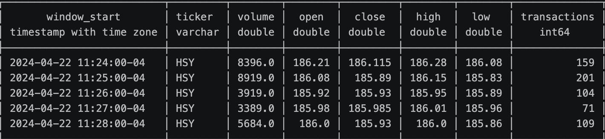

# Hershey Stock Reward Valuation Project

## Calculating Volatillity
Volatillity was calculated using minute aggregate data set from massive.com api. Data was restricted to trading hours between 9:30-4:30pm and resampled using pandas to a five minute window.
### Sample Data 
```sql
WITH log_returns AS (
    SELECT
        *,
        LN(close / LAG(close) OVER (
            PARTITION BY DATE(window_start)
            ORDER BY window_start
        )) AS log_return
    FROM hsy_stock_data.parquet
),
params AS (
    SELECT
        STDDEV(log_return) * SQRT(252 * 78)*100  AS annualized_vol,
        LAST(close ORDER BY window_start) 
            FILTER (WHERE DATE(window_start) = '2025-10-30')  AS spot_price
    FROM log_returns
    WHERE log_return IS NOT NULL
)
SELECT
    annualized_vol,
    (1.370 * 4 / spot_price)*100 AS dividend_yield
FROM params
```
Volatillity Calculation: 23.56%
Dividend Yield calculation: 3.202%

## Calculating Risk Free Rate (RFR)
RFR was calclated from the 3-Year treasury dated 10/30/2025 with a semi-annual rate of 3.61
```sql
    SELECT
        (2*LN(1+("3 YR"/100)*(1/2)))*100 AS continous_rfr
    FROM treasury_yield.parquet
    where Date = '10/30/2025'
```
RFR Calculation 3.577%